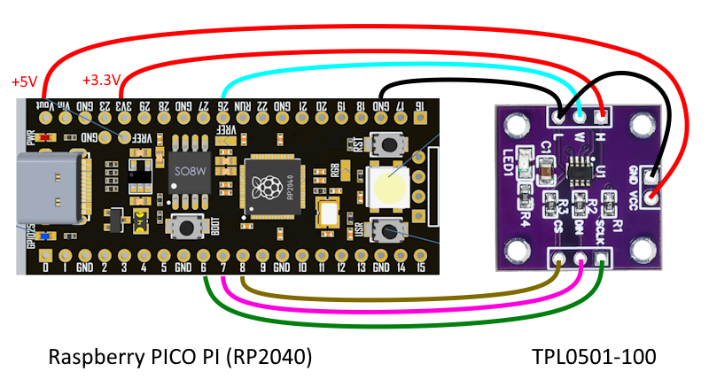

A library for MicroPython to control digital potentiometer
(DPOT) TPL0501, a single-channel, linear-taper, with 256 wiper
positions. This device can be used as a three-terminal potentiometer
or as a two-terminal rheostat. The TPL0501 is currently offered
with end-to-end resistance of 100 kΩ. The internal registers
of the TPL0501 can be accessed using a SPI-compatible interface.

See TPL0501 datasheet:
https://www.ti.com/lit/ds/symlink/tpl0501-100.pdf?ts=1736053555929

According to Table 2. DPOT Ideal Values ​​in the datasheet, the resistance for 0 value is 0.00Ω and for 255 is 99.61kΩ.
The resistance value of the potentiometer, 100kΩ, however, it may vary a lot from a minimum of 80k to a maximum of 120kΩ.

Note, as for the mechanical potentiometer, there is no interface
to read the current wiper's position. According to the datasheet,
section 9.2 Wiper Position Upon Power Up, when DPOT is powered off,
the impedance of the device is not known. Upon power up, the device
will reset to 0x80 code (middle position) because this device does
not contain non-volatile memory.

The library should work for any microcontroller that supports MicroPython. As an example, let's use Raspberry Pi Pico. Connect TPL0501 module to a microcontroller as shown below. You don't need the level shifter, the module works with 3.3V directly from the microcontroller, but you can provide 5V to power it and separate use 3.3V as V(H) to not saturate Pico's ADC. Upload the file 'tpl0501.py' to a microcontroller and run the test program 'test_tpl5001.py'.

